  

<!-- ===================== Section 2 ===================== -->

<!-- ===================== Section 3 ===================== -->

  <a href="#developer-identity"><strong>About</strong></a>&nbsp;&nbsp;•&nbsp;&nbsp;
  <a href="#featured-projects"><strong>Projects</strong></a>&nbsp;&nbsp;•&nbsp;&nbsp;
  <a href="#technology-stack"><strong>Tech Stack</strong></a>&nbsp;&nbsp;•&nbsp;&nbsp;
  <a href="#current-focus"><strong>Current Focus</strong></a>&nbsp;&nbsp;•&nbsp;&nbsp;
  <a href="#contact"><strong>Contact</strong></a>

<!-- ===================== DEVELOPER IDENTITY ===================== -->

<table width="100%">
<tr>

<td width="38%" align="center" valign="middle">

</td>

<td width="62%" valign="top">

<h2>Professional Summary</h2>

I develop practical, database-driven software solutions across fintech,
startup collaboration, healthcare management, and enterprise HR workflows.
My project experience includes responsive interface development,
authentication, role-based access, CRUD operations, database integration,
workflow design, and technical documentation.

My technical direction combines software engineering, full-stack development,
AI-enabled applications, and data analytics. I am currently strengthening my
MERN stack, data structures and algorithms, system design, and applied AI/ML
capabilities to build reliable, scalable, and user-focused digital solutions.

<h4>Core Domains</h4>

<h4>Connect with Me</h4>

  

  

</td>

</tr>
</table>

<!-- ===================== END DEVELOPER IDENTITY ===================== -->

<!-- ===================== FEATURED PROJECTS ===================== -->

 

  

  A selection of practical software projects reflecting my experience in
  full-stack development, AI-enabled financial applications, startup collaboration,
  healthcare management, and enterprise workforce operations.

 

<table width="100%" cellpadding="14">

<tr>

<!-- ===================== ZORO AI ===================== -->

<td width="50%" valign="top">

 

  

  An AI-enabled FinTech application developed to support budgeting, expense
  tracking, and financial organization through responsive web and mobile
  interfaces. The platform combines structured financial management with
  intelligent, user-focused insights to help users better understand and manage
  their financial activities.

  
  
  
  

  

 

</td>

<!-- ===================== INVESTNOOK ===================== -->

<td width="50%" valign="top">

 

  

  An investor–startup collaboration platform designed to connect emerging
  ventures with potential investors through structured startup listings,
  discovery workflows, secure authentication, and database-driven operations.
  The system supports organized venture presentation and communication between
  platform participants.

  
  
  
  

  

 

</td>

</tr>

<tr>

<!-- ===================== HOSPITAL MANAGEMENT SYSTEM ===================== -->

<td width="50%" valign="top">

 

  

  A centralized healthcare operations platform developed to manage patient
  information, doctor records, appointments, and administrative activities
  through structured role-based workflows. The system improves organization,
  access control, and coordination across essential hospital management
  processes.

  
  
  
  

  

 

</td>

<!-- ===================== HUMAN RESOURCE MANAGEMENT SYSTEM ===================== -->

<td width="50%" valign="top">

 

  

  An enterprise-oriented workforce management solution developed to organize
  employee records, attendance, departmental coordination, and administrative
  operations. The platform centralizes HR-related information and supports
  structured workflows for efficient employee and workforce data management.

  
  
  
  

  

 

</td>

</tr>

</table>

<!-- =================== END FEATURED PROJECTS =================== -->

<!-- ===================== TECHNOLOGY STACK ===================== -->

 

  

  Technologies and tools I use across software development, full-stack applications,
  databases, AI-enabled systems, and data analytics.

 

<table width="100%" cellpadding="14">
<tr>

<!-- ===================== LANGUAGES ===================== -->

<td width="25%" valign="middle" align="center">

 

<h3>Languages</h3>

  

 

</td>

<!-- ===================== FRONTEND ===================== -->

<td width="25%" valign="middle" align="center">

 

<h3>Frontend</h3>

  

 

</td>

<!-- ===================== BACKEND ===================== -->

<td width="25%" valign="middle" align="center">

 

<h3>Backend & Databases</h3>

  

 

</td>

<!-- ===================== TOOLS ===================== -->

<td width="25%" valign="middle" align="center">

 

<h3>Tools & Platforms</h3>

  

 

</td>

</tr>
</table>

<!-- =================== END TECHNOLOGY STACK =================== -->

<!-- ===================== CURRENT FOCUS ===================== -->

 

  

  Currently expanding my expertise through real-world projects, continuous learning,
  and building scalable software solutions across software engineering, AI, data analytics,
  and modern development technologies.

 

<table width="90%" cellpadding="0" cellspacing="0">
<tr>

<td width="25%" align="center" valign="middle">

</td>

<td width="25%" align="center" valign="middle">

</td>

<td width="25%" align="center" valign="middle">

</td>

<td width="25%" align="center" valign="middle">

</td>

</tr>
</table>

<!-- ===================== END CURRENT FOCUS ===================== -->

<!-- ===================== CONTACT ===================== -->

  
  

<!-- ===================== END CONTACT ===================== -->
